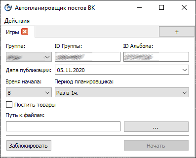

# Авто-Планировщик записей сообщества ВК 
***
Графическое приложение написанное на PySide2, позволяющее запланировать выпуск записей в сообществе ВК с определенным промежутком времени.
Требует библиотеки PySide2 и vk_api для корректной работы.
  
***
# Mini FAQ
—Как выбрать записи? 
—Записями считаются любые файлы изображений с расширением: `.png`, `.jpg` или `.jpeg` в выбранном каталоге.

—Как добавить текст к записи? 
—Текст записи можно записать в одноименном изображению файле изменив расширение на ".desc". К примеру, вместе с фотографией `logo.png` будет выложен текст, содержащийся в файле `logo.desc`

—Название моей группы изменилось, как мне поменять название и в программе? 
—В меню `Действия` есть пункт `Изменить группы`, позволяющий отредактировать информацию о группах.

—Для чего нужна опция `Постить товары`? 
—Данная опция переключает постер в режим планировки публикации всех товаров группы в случайном порядке. Текст, указываемый в посте, определен заранее в файле `profileData.json` (с.м. [пример](profileData.json)).

—Безопасно ли предоставлять программе свой токен вместе с id группы? 
—Это совершенно безопасно и убедиться в этом вы можете сами, открыв исходный код проекта.